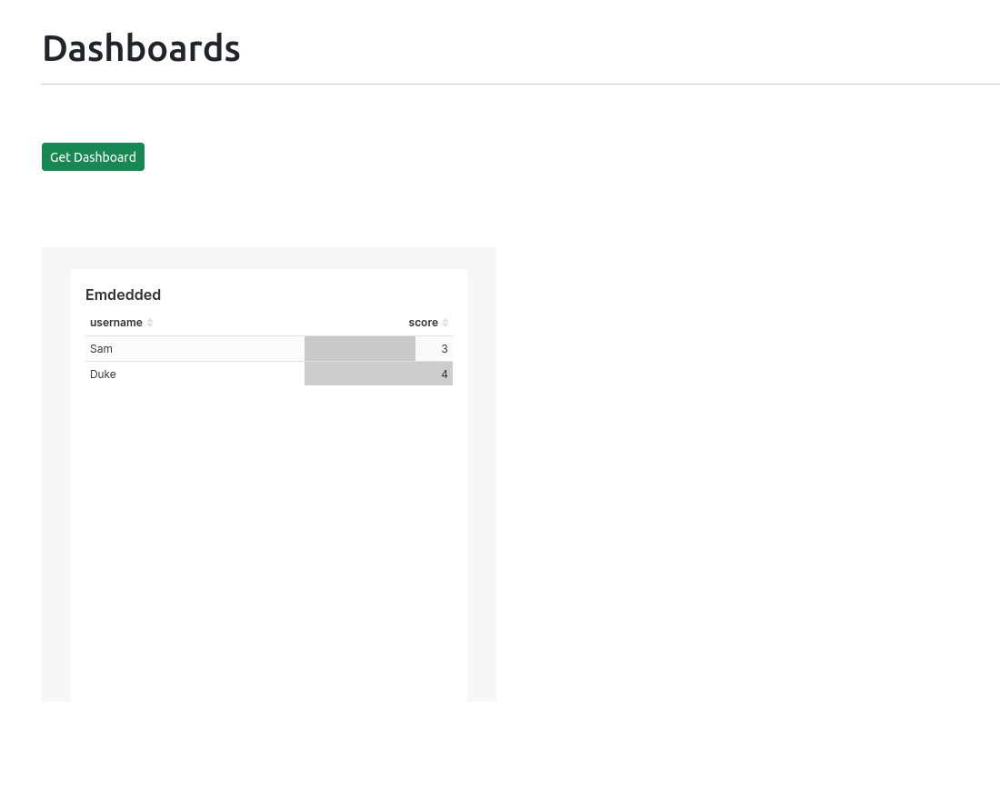

# WebApp Demo with embeded Superset Dashboard



## Backend (Flask)
### app.py
Для получения встраивания дашбордов из суперсета необходимо делать три типа запросов к его API

- /api/v1/security/guest_token/ - ```GUEST_TOKEN``` нужен непосредственно для дашборда 
- /api/v1/security/refresh - токен для обновления ```ACCESS_TOKEN```
- /api/v1/security/login - для получения ```ACCESS_TOKEN``` и ```REFRESH_TOKEN```

ACCESS_TOKEN действителен по дефолтным настройкам Superset 300 секунд, после чего, его надо обновить. Для его получения необходимо передать информацию о пользователе, c необходимыми привелегиями для его генерации см.  

```python 
ADMIN
def get_tokens()
```

Для обновления ACCESS_TOKEN см.

```
def refresh_access_token():
```

Frontend запрашивает непосредственно ```GUEST_TOKEN```, для его генерации нужны:

- ```dashboard_id``` - генерируется суперсетом для борда один раз и используется для доступа к нему
- информация о запрашивающем пользователе ```USER```
- Информация о фультрации данных в дашборде под конкретного пользователя ```CLAUSE```
- В Headers передать ```ACCESS_TOKEN```

```python
def get_guest_token
def guest_token
```

По идее следует сделать несколько дашбордов сразу на всех пользователей и фильтровать выдачу при помощи ```CLAUSE``` по user_id, например, чтобы был ограниченный набор ```dashboard_id```

## FRONTEND

Компонента со встраиваемым дашбордом см.

```
/flask-vue-crud/src/components/DashBoard.vue
```

Запросы к Backend при помощи Axios, встраивание самого дашборда производится при помощи функции ```embedDashboard``` из ``` '@superset-ui/embedded-sdk' ```, [https://www.npmjs.com/package/@superset-ui/embedded-sdk]. Нужны:

- id дашборда (генерируются один раз суперсетом)
- адрес самого Superset
- элемент куда можно замаунтить iframe
- функция возвращающая Promise c ```GUEST_TOKEN``` с бэкэнда
- Словарь со свойствами возвращаемого дашборда

Свойства самого возвращаемого ```iframe``` можно изменить в 

```
async function mountIframe() 
```

По пути ```@superset-ui/embeded-sdk/lib/index.js```

   [dill]: <https://github.com/joemccann/dillinger>
   [git-repo-url]: <https://github.com/joemccann/dillinger.git>
   [john gruber]: <http://daringfireball.net>
   [df1]: <http://daringfireball.net/projects/markdown/>
   [markdown-it]: <https://github.com/markdown-it/markdown-it>
   [Ace Editor]: <http://ace.ajax.org>
   [node.js]: <http://nodejs.org>
   [Twitter Bootstrap]: <http://twitter.github.com/bootstrap/>
   [jQuery]: <http://jquery.com>
   [@tjholowaychuk]: <http://twitter.com/tjholowaychuk>
   [express]: <http://expressjs.com>
   [AngularJS]: <http://angularjs.org>
   [Gulp]: <http://gulpjs.com>

   [PlDb]: <https://github.com/joemccann/dillinger/tree/master/plugins/dropbox/README.md>
   [PlGh]: <https://github.com/joemccann/dillinger/tree/master/plugins/github/README.md>
   [PlGd]: <https://github.com/joemccann/dillinger/tree/master/plugins/googledrive/README.md>
   [PlOd]: <https://github.com/joemccann/dillinger/tree/master/plugins/onedrive/README.md>
   [PlMe]: <https://github.com/joemccann/dillinger/tree/master/plugins/medium/README.md>
   [PlGa]: <https://github.com/RahulHP/dillinger/blob/master/plugins/googleanalytics/README.md>
